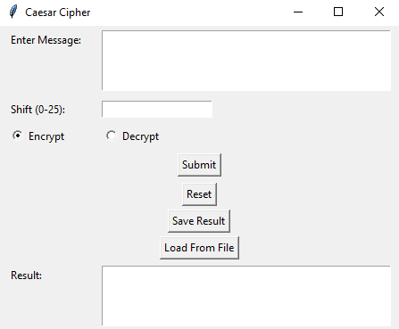

<h1 align="center">🛡️ Caesar Cipher GUI Tool</h1>

A simple and user-friendly **Caesar Cipher** encryption and decryption tool with a graphical interface built using Python's `tkinter`. Easily encrypt or decrypt messages, load/save files, and reset your workspace.

## 📦 Features

- 🔐 Encrypt and decrypt messages using Caesar Cipher logic
- 🔁 Choose shift value (0–25)
- 📂 Load messages from `.txt` files
- 💾 Save encrypted/decrypted output to a file
- 🧹 Reset all fields in one click
- ✅ GUI-based for ease of use

## 🖼️ Screenshot

Here’s what the Caesar Cipher GUI looks like:



## 🚀 How to Run

1. Make sure you have **Python 3** installed.
2. Clone this repository or download the `main.py` file.
3. Run the script:

```bash
python main.py
```
## 🧠 How It Works
The Caesar Cipher shifts each letter in the message by a specified number of positions through the alphabet.

**For example, with a shift of 3:**

A → D

X → A

z → c

It wraps around the alphabet and ignores non-alphabet characters (like numbers, punctuation, and spaces).

## ⚙️ Requirements
- Python 3.x

- No external libraries required

- Uses built-in tkinter, messagebox, and filedialog

## 📌 Notes
Make sure to enter a valid shift value between 0 and 25

You can load text from files and save results as .txt

## 📄 License
This project is licensed under the [License: MIT](https://github.com/Kaif-T-200/Caesar-Cipher/blob/main/LICENSE)

Feel free to use, modify, and distribute it for educational or personal use.

## 👤 Author

[LinkedIn](https://www.linkedin.com/in/kaif-tarasgar-0b5425326/) • [Twitter/X](https://x.com/Kaif_T_200)

# Made with ❤️ by Kaif Tarasgar in Python
